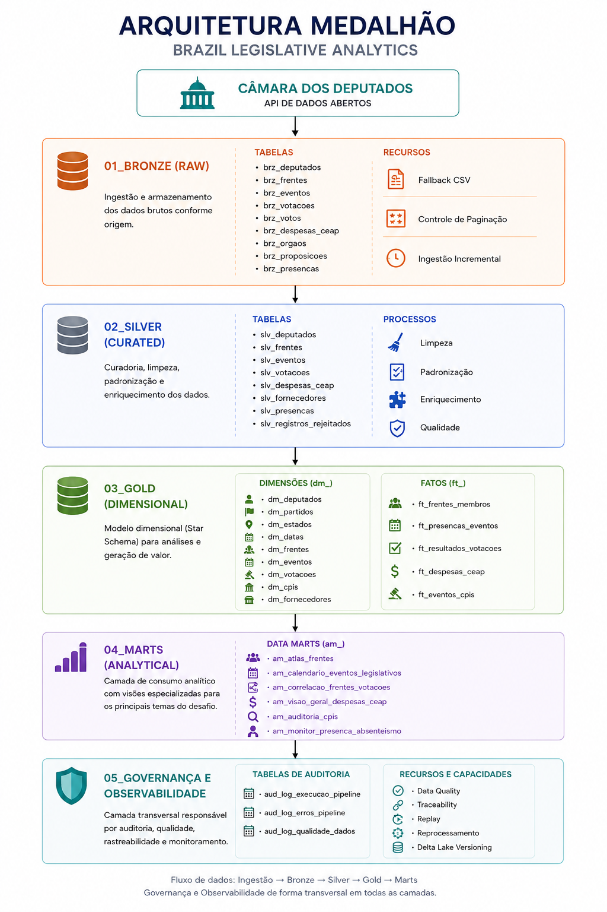
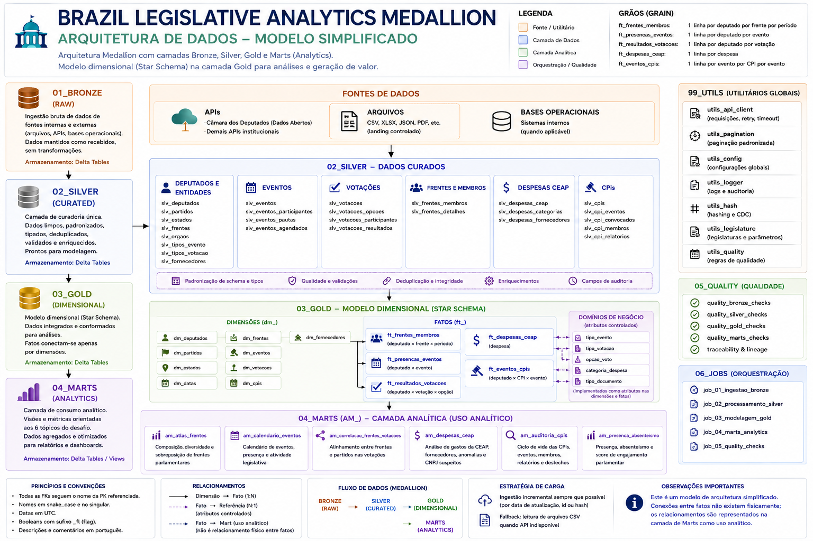
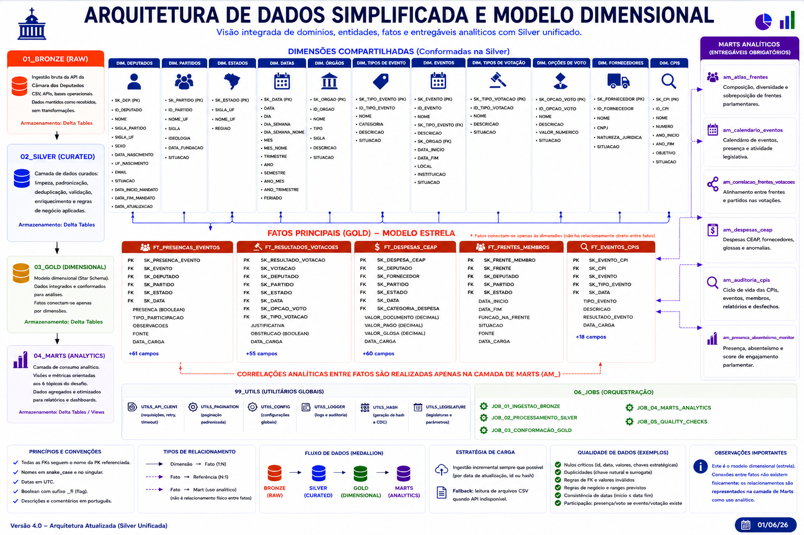
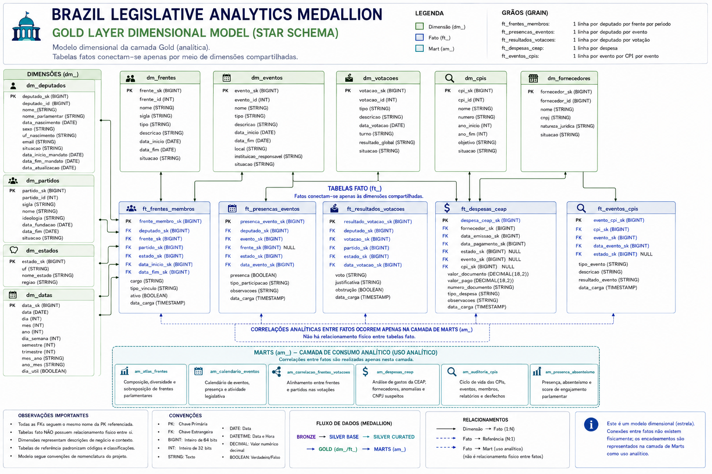
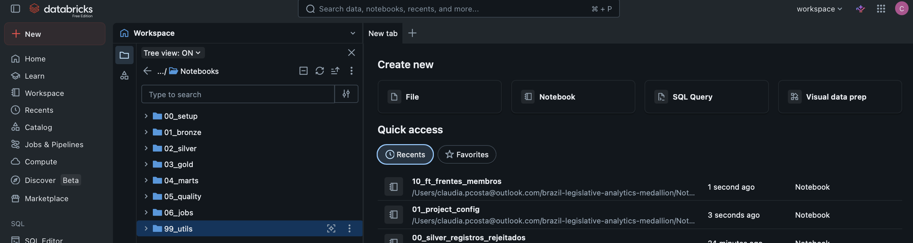
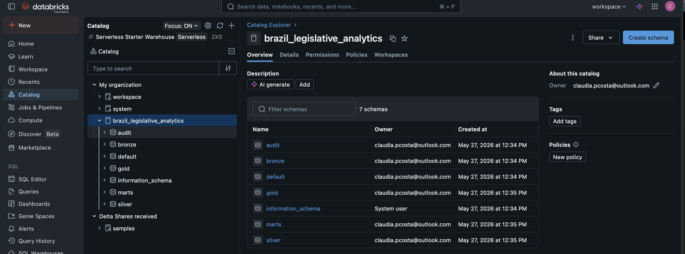
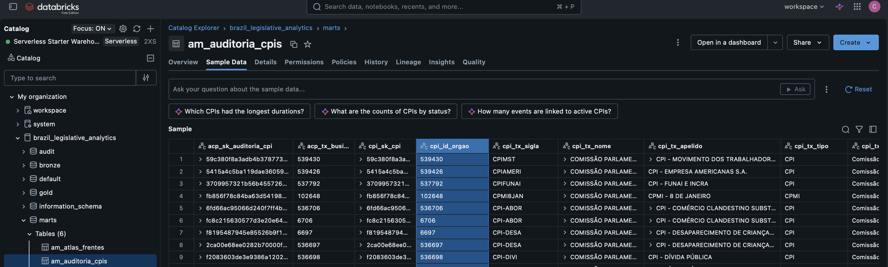

# Brazil Legislative Analytics Medallion

## Legislative Analytics Platform Built on Databricks Medallion Architecture

🇺 English | [🇧 Português](README.pt-BR.md)

GitHub Repository:

https://github.com/claupcosta/brazil-legislative-analytics-medallion

A complete data platform developed for ingestion, curation, dimensional modeling, governance, quality control, and analytical consumption of Brazilian Chamber of Deputies open data using Databricks, Apache Spark, Delta Lake, and Medallion Architecture.

The solution follows modern Data Engineering, Analytics Engineering, Data Governance, Data Quality, and Observability best practices, simulating enterprise-grade data platform standards.

---

# How to Evaluate This Project

## Repository

This repository contains all source code, notebooks, architecture diagrams, dimensional models, governance artifacts, analytical products, and supporting documentation.

---

## 1. Solution Understanding

* `docs/challenge/08_solution_adherence_matrix.md`

A complete traceability matrix mapping challenge requirements to implementation evidence.

---

## 2. Architecture

* `docs/architecture/01_solution_architecture.md`
* `docs/architecture/01_medallion_architecture_overview.png`
* `docs/architecture/02_end_to_end_data_flow.png`
* `docs/architecture/03_star_schema_model.png`

Architecture, end-to-end data flow, and dimensional modeling documentation.

---

## 3. Data

* `docs/data_dictionary/02_data_dictionary.md`
* `docs/data_dictionary/legislative_data_dictionary.xlsx`

Technical data dictionary containing tables, columns, business rules, and metadata.

---

## Executive Summary

The platform implements a complete Medallion Architecture using Databricks to process legislative data from the Brazilian Chamber of Deputies.

### Key Deliverables

* Medallion Architecture (Bronze, Silver, Gold and Marts)
* Star Schema Dimensional Model
* 6 Analytical Data Marts
* Data Quality Framework
* Traceability Framework
* Metadata Governance
* Incremental Processing
* CSV Fallback Strategy
* Operational Auditing
* Replay and Recovery Capabilities
* Comprehensive Technical Documentation

---

# Solution Overview



The solution was built using Databricks Medallion Architecture, clearly separating ingestion, curation, dimensional modeling, and analytical consumption layers.

### Main Characteristics

* Medallion Architecture
* Delta Lake
* Dimensional Modeling
* Governance
* Auditing
* Data Quality
* Incremental Processing
* CSV Fallback
* Specialized Analytical Data Marts

📷 Additional Diagrams

* [End-to-End Data Flow](docs/architecture/02_end_to_end_data_flow.png)
* [Dimensional Model (Star Schema)](docs/architecture/03_star_schema_model.png)

---

# Project Objective

This project was developed for educational purposes, Data Engineering portfolio development, and demonstration of enterprise-grade data platform practices.

The solution simulates modern data engineering environments including:

* Medallion Architecture
* Data Governance
* Operational Auditing
* Data Quality
* Traceability
* Incremental Processing
* Replay and Recovery
* Dimensional Modeling
* Analytical Data Marts

---

# Solution Architecture

## Layers

| Layer   | Purpose                                 |
| ------- | --------------------------------------- |
| Bronze  | Raw data ingestion and preservation     |
| Silver  | Data curation, cleansing and enrichment |
| Gold    | Enterprise dimensional model            |
| Marts   | Analytical consumption layer            |
| Quality | Governance, quality and traceability    |

---

## Schema Organization

The platform physically separates data into schemas following Medallion Architecture principles.

| Schema | Purpose                    |
| ------ | -------------------------- |
| audit  | Auditing and observability |
| bronze | Raw data                   |
| silver | Curated data               |
| gold   | Dimensional model          |
| marts  | Analytical products        |

📷 Evidence

[View Catalog Organization](docs/images/catalog_structure.png)

This segregation improves governance, traceability, and layer independence.

---

# Technologies Used

| Category        | Technology             |
| --------------- | ---------------------- |
| Platform        | Databricks             |
| Language        | Python                 |
| Processing      | Apache Spark / PySpark |
| Storage         | Delta Lake             |
| Governance      | Unity Catalog          |
| Orchestration   | Databricks Workflows   |
| Version Control | GitHub                 |
| Data Quality    | Custom Framework       |
| Traceability    | Custom Framework       |

---

# Analytical Products

The Marts layer provides the following analytical products:

| Data Mart                      | Purpose                                        |
| ------------------------------ | ---------------------------------------------- |
| am_atlas_frentes               | Parliamentary fronts composition and diversity |
| am_calendario_eventos          | Legislative events calendar                    |
| am_correlacao_frentes_votacoes | Fronts versus voting behavior analysis         |
| am_despesas_ceap               | Parliamentary expenses analysis                |
| am_auditoria_cpis              | CPI monitoring and auditing                    |
| am_presenca_absenteismo        | Attendance and engagement indicators           |

📷 Evidence

[View Analytical Product Example](docs/images/produto_analiticos.png)

---

# Repository Structure

```text
BRAZIL-LEGISLATIVE-ANALYTICS-MEDALLION/
│
├── docs/
├── notebooks/
├── README.md
├── README.pt-BR.md
├── requirements.txt
└── .gitignore
```

---

# Governance and Observability

Implemented governance capabilities include:

* Operational Auditing
* Data Quality Framework
* Traceability Framework
* Metadata Governance
* Technical Logging
* Replay Capabilities
* Reprocessing Control
* Rejected Records Management
* Data Lineage
* Delta Lake Versioning

---

# Visual Evidence

## Medallion Architecture



---

## End-to-End Data Flow



---

## Star Schema



---

## Databricks Workspace



---

## Catalog Structure



---

## Analytical Product Example



---

# Author

## Claudia Costa

Data Engineer focused on Lakehouse Architecture, Databricks, Data Governance, Data Quality, Traceability, and Analytical Platforms.

This project was developed for educational purposes, technical portfolio development, and demonstration of Data Engineering skills.

---

# License

This project uses exclusively public data provided by the Brazilian Chamber of Deputies and complementary public sources.

All analytical artifacts were developed for educational, research, and portfolio purposes.
